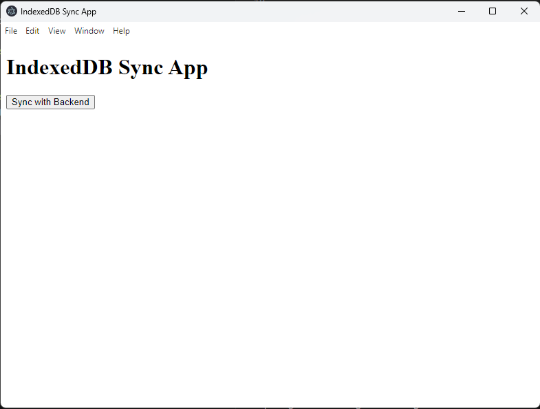

# IndexDB-sincron-mongoDB
 Sincron data from local with IndexDB on MongoDB

## A. Inplement frontend
mkdir frontend
cd frontend
npm init -y
npm install electron

### A. Start Electron:

cd frontend
npx electron .

---

## B. Inplement Backend
mkdir backend
cd backend
npm init -y
npm install express mongoose body-parser cors

### a. Start backend-ului

cd backend
node server.js